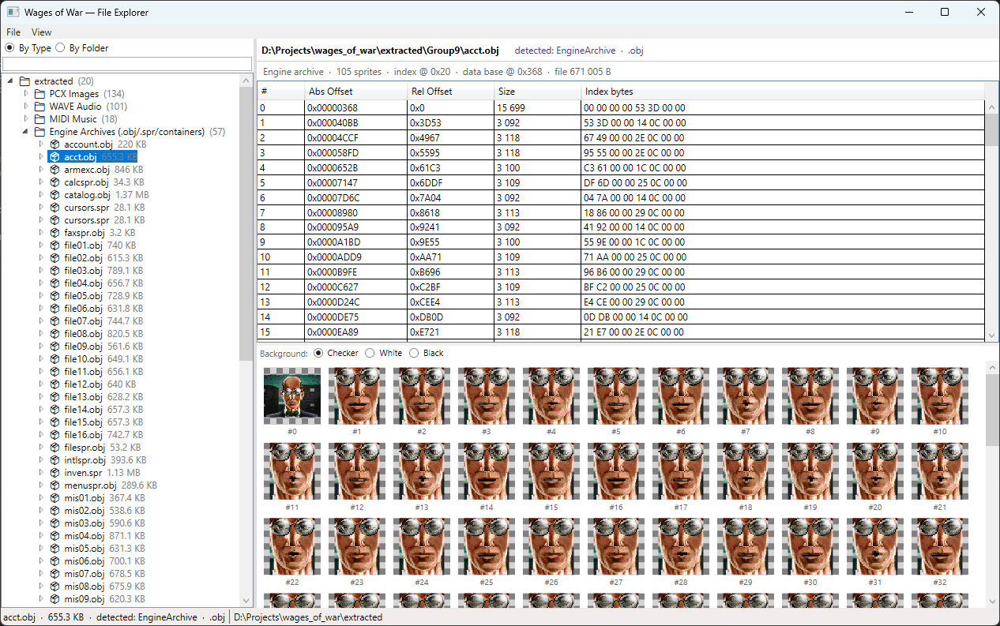

# Wages of War Explorer

A WPF file browser for the game data of **Wages of War: The Business of Battle** (1996, New World Computing).



## What it does

Browses the extracted installer groups and ISO game files, detecting and rendering each format natively:

| Format | Viewer |
|---|---|
| PCX images | Decoded and displayed as WPF images |
| Engine archives (.obj/.spr, MISC.DAT, OFFCSPR.DAT) | Tree of contained sprites/frames |
| VALS containers (.VLS/.VLA) | Waveform strips + embedded WAV playback |
| Standalone WAV audio | Waveform + play/stop controls |
| MIDI | Hex preview |
| Bitmap fonts (.CHR) | Glyph grid |
| MS Write documents (.WRI) | Plain-text extraction |
| OLE compound documents | Hex preview |
| Win32 PE binaries (.EXE/.DLL/.DRV) | Hex preview |
| Windows ICO/CUR | WPF image decode |
| Mission scripts (.VAL/.TXT) | Text viewer |
| Sprite correlation tables (.COR) | Text viewer |
| UI button layouts (.BTN) | Text viewer |
| Weapon shop inventories (.DAT) | Text viewer |
| AI waypoint lists (.DAT) | Text viewer |
| Mission setup files (.DAT) | Text viewer |
| Speech scripts (.DAT) | Text viewer |
| Generic text files | Text viewer |

The **By Type** view groups all files across all extracted groups by detected format.

## Requirements

- .NET 8 SDK (`net8.0-windows`)
- Windows (WPF)

## Building

```
dotnet build
```

## Data

The game files were extracted from the installer inside the ISO using [unshield](https://github.com/twogood/unshield), which unpacks InstallShield cabinet archives into numbered groups (`Group1`–`Group13`).

Point the app at those extracted groups or the ISO game directory. The extracted data is **not** included in this repository.